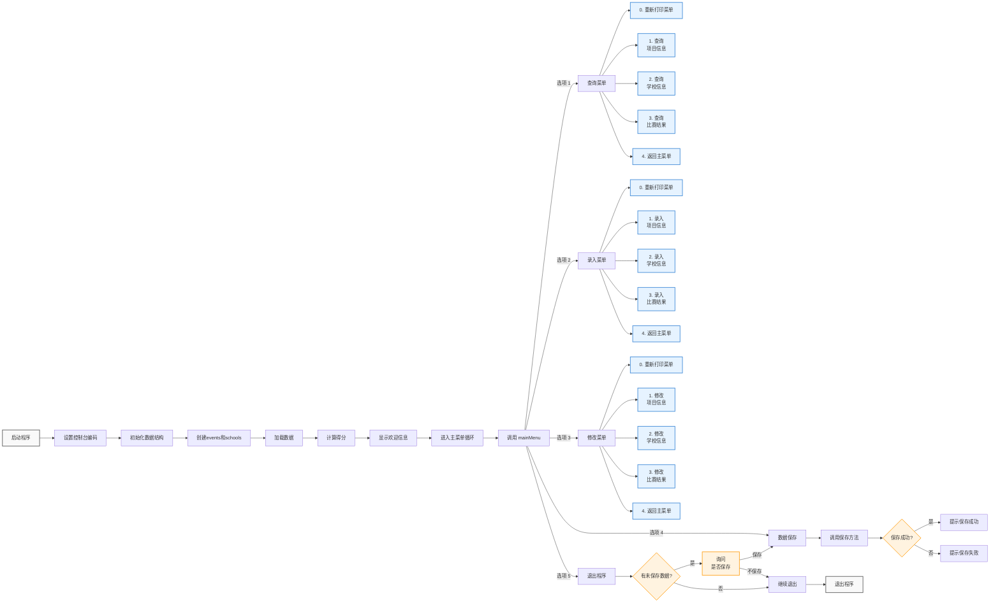

# 运动会计分系统

## 流程图


## 项目详细描述

### 题目

#### 问题描述

本系统为运动会计分系统，参赛学校数为 n（编号 1 至 n），比赛项目分为 m 个男子比赛项目和 w 个女子比赛项目（男子项目编号 1 至 m，女子项目编号 m+1 至 m+w）。各比赛项目可采用不同计分规则：部分项目采用“前五名”积分规则（积分依次为 7、5、3、2、1），其余项目采用“前三名”积分规则（积分依次为 5、3、2）。项目对应的计分方式可在录入时自定义（注意约束：m≤20，n≤20）。

#### 功能要求

1. **成绩录入**
   - 支持输入各场比赛中的运动员真实成绩（例如，对于男子百米赛，仅录入实际成绩如 9″8，而不是积分）。
   - 根据各项目的计分规则，录入运动员的成绩及对应排名（前三名或前五名）。

2. **成绩统计**
   - 自动统计并计算每个学校的总分，包括男子团体得分、女子团体得分以及总得分。
   - 根据录入成绩，依据不同项目的计分规则累计各校积分。

3. **排序与查询**
   - 可按学校编号、学校名称、总得分、男子/女子团体得分进行排序输出。
   - 支持按学校编号查询该校在特定比赛项目中的详细得分情况。
   - 同时支持按比赛项目编号查询该项目中排名前列（前三或前五）的学校列表。

4. **数据保存与校验**
   - 所有数据（学校信息、项目成绩数据等）均存储于文件中，并带有校验机制，防止文件被非法修改。
   - 修改数据后，可通过菜单操作保存最新数据，确保数据的持久化和安全性。

#### 规定

- **输入要求**：允许输入学校名称、比赛项目名称及运动员实际成绩；对非法数据进行拦截和提示。
- **输出要求**：所有操作均提供中文提示，成绩和积分以整数形式显示。
- **界面要求**：系统采用命令行菜单交互方式，每个功能均配有详细提示，确保使用流程直观、简单。
- **存储结构**：利用链表管理数据，各模块数据存储在文件中，并包含校验信息，确保文件数据安全。

### 简介

本项目实现一个基于命令行菜单交互的运动会计分系统，主要功能包括：
- 录入、修改和查询比赛项目信息、学校信息及成绩数据；
- 根据项目不同计分规则对各校成绩进行统计与排名；
- 支持按多种条件（编号、名称、得分）排序输出查询结果；
- 数据持久保存，内置校验机制防止数据文件被非法篡改。

### 功能特性

- **录入功能**：支持详细录入比赛项目信息、学校信息及运动员成绩；录入时根据计分规则（前三名或前五名）自动识别并录入指定成绩。
- **修改功能**：允许对已录入数据进行修改或删除，确保数据实时更新。
- **查询统计**：实现按编号、名称、得分等多种查询排序方式，同时可针对单项比赛或单个学校进行数据查询。
- **数据校验**：系统保存数据时附带文件修改时间校验，防止数据被篡改或错误导入，确保数据的完整性。
- **模块化设计**：采用链表等数据结构和模块化设计，使用 CMake 构建，便于维护和扩展。

### 项目结构

- **include/**：存放项目头文件和公共宏定义。
- **src/**：包括核心数据处理、打印、菜单、文件存取等各模块的源代码实现。

### 编译与运行

#### 环境依赖

- CMake（版本 3.10 及以上）
- MinGW 或其它标准 C 语言编译器

#### 编译步骤

1. 新建构建目录：
   ```bash
   mkdir build
   ```
2. 进入构建目录并配置项目：
   ```bash
   cd build
   cmake ../
   ```
   如需指定生成器，可使用：
   ```bash
   cmake -G "MinGW Makefiles" ../
   ```
3. 构建项目：
   ```bash
   cmake --build .
   ```
4. 编译完成后，在 `build/bin` 目录下运行生成的 `Scorecalculation.exe` 程序。

### 数据配置

- **config.h.in**：用于 CMake 配置生成项目所需的 `config.h` 文件。
- **data.ini**：数据存储文件，记录学校信息和比赛成绩；修改后可能导致校验失败，请按程序提示操作数据。

### 使用说明

运行程序后，系统将展示主菜单，通过数字编号选择不同功能：
- **主菜单**：提供信息查询、录入、修改和数据保存选项。
- **查询菜单**：提供项目信息、学校信息及比赛成绩的查询，并支持多种排序方式。
- **录入菜单**：支持录入比赛项目信息、学校信息及运动成绩。
- **修改菜单**：允许对已有数据进行修改和删除。
- **数据保存**：修改数据后请及时保存，以确保数据持久化，并在退出前检查是否存在未保存数据。

### 注意事项

- 切勿直接修改数据存储文件（data.ini）以避免破坏数据校验。
- 程序内部含有调试模式，便于开发和测试时输出详细提示信息。
- 系统全面考虑了数据非法输入情况，确保在各种情况下均有合理提示，保障程序稳定运行。

### 版权与许可

本项目代码仅供学习和研究使用，禁止商业用途。分发时请保留原作者信息和版权声明。

*By LeonardoTan*
